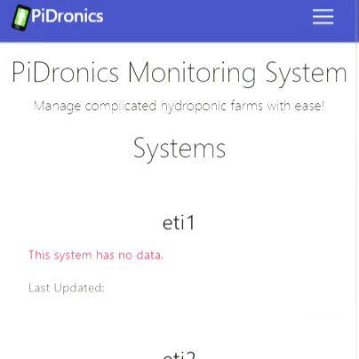
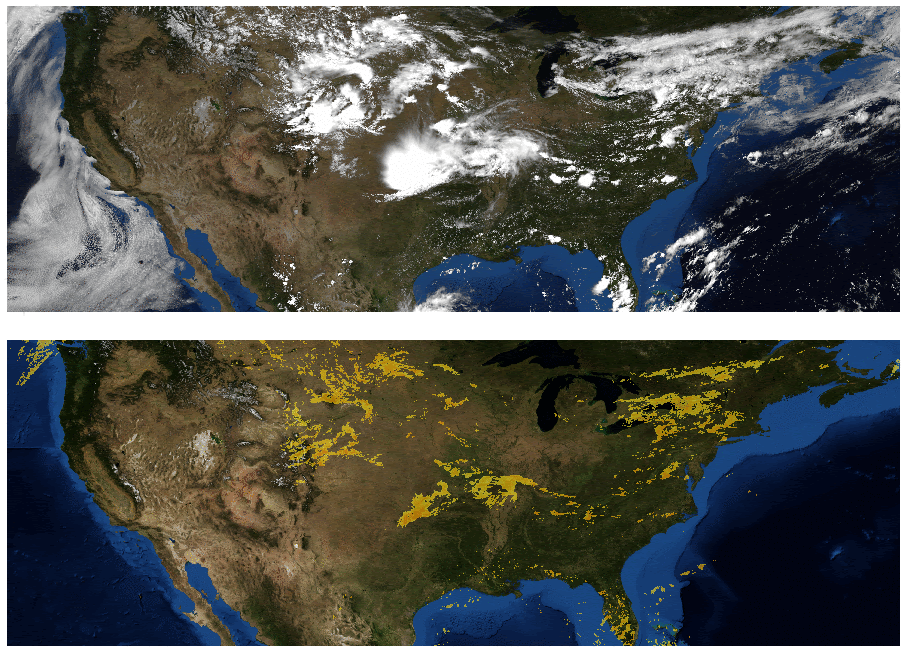

## 2019
*** 
### QuickRental &emsp;&emsp;&emsp;&emsp;&emsp;&emsp;&emsp;&emsp;&emsp;&emsp;&nbsp;&nbsp; AntiPlasti
31st May &emsp;&emsp;&emsp;&emsp;&emsp;&emsp;&emsp;&emsp;&emsp;&emsp;&emsp;&emsp;&emsp;&emsp;&emsp;&nbsp;&nbsp; 10th Feb
{:.faded}
<!-- GIFs -->
{:width="300" height="300" loading="lazy"} &emsp;&nbsp;
{:width="300" height="300" loading="lazy"}

<!-- https://github.com/quickrentalteam -->
<!-- https://github.com/antiplasti -->

## 2018
*** 
### PiDronics &emsp;&emsp;&emsp;&emsp;&emsp;&emsp;&emsp;&emsp;&emsp;&emsp;&emsp;&nbsp;&nbsp; DCIT BootCamp
22nd Dec &emsp;&emsp;&emsp;&emsp;&emsp;&emsp;&emsp;&emsp;&emsp;&emsp;&emsp;&emsp;&emsp;&emsp;&emsp;&nbsp;&nbsp; July 2017/2018
{:.faded}
<!-- GIFs -->
{:width="300" height="300" loading="lazy"} &emsp;&nbsp;
{:width="300" height="300" loading="lazy"}

<!-- https://github.com/PiDronics -->

## 2017
*** 
### METOracle 
31st October 
{:.faded}
<!-- GIFs -->
{:width="300" height="300" loading="lazy"} 

<!-- https://github.com/irontarkus95/MET-Oracle-lstm-time-series-weather-prediction -->

Continue with [Resume](resume.md){:.heading.flip-title}
{:.read-more}
